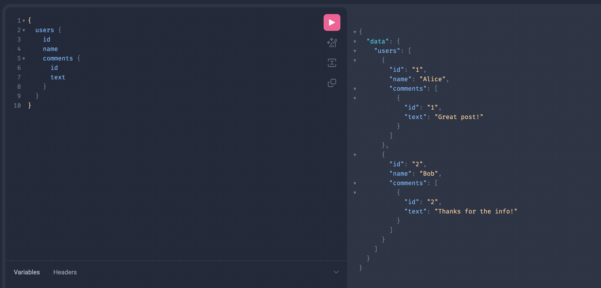
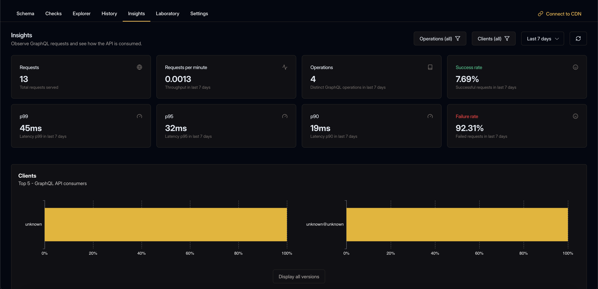

# GraphQL Mesh <> Hive Demo

In this demo, you'll learn how to integrate [GraphQL Mesh](https://the-guild.dev/graphql/mesh) with [Hive](https://the-guild.dev/graphql/hive). We'll show you how to set up a local supergraph, publish subgraphs, connect to Hive for supergraph polling, usage reporting, and schema management. You'll also see how to use key plugins in GraphQL Mesh, like response caching, rate limiting and authentication. By following this guide, you'll be able to set up and run your own GraphQL Mesh instance with Hive, making your GraphQL API management easier.

## Table of Contents

1. [The Complete Federation Solution](#the-complete-federation-solution)
2. [Create a Hive Account and Project](#1-create-a-hive-account-and-project)
3. [Explore the Subgraphs](#3-explore-the-subgraphs)
4. [Run GraphQL Mesh (the gateway)](#5-run-graphql-mesh-the-gateway)
5. [Hive Integration](#6-hive-integration)
   - [Hive CLI Access Token](#1-hive-cli-access-token)
   - [Publish your schemas](#2-publish-your-schemas)
   - [Check Your Schema](#3-check-your-schema)
   - [Fetch the Supergraph from Hive](#4-fetch-the-supergraph-from-hive)
   - [Set Up GraphQL Mesh with Hive](#5-set-up-graphql-mesh-with-hive)
   - [Usage reporting](#6-usage-reporting)


## The Complete Federation Solution

GraphQL Mesh and Hive together offer a complete federation solution that allows you to manage your GraphQL APIs with ease and flexibility. Here’s how each component contributes:

- **GraphQL Mesh**: Acts as a gateway that enables you to integrate and manage distributed GraphQL APIs (subgraphs). It provides powerful plugins for enhanced API capabilities, such as response caching, rate limiting, authentication, tracing, and more.

- **Hive**: A schema registry and management tool that allows you to version, monitor, and manage your GraphQL schemas. Hive handles the schema composition and versioning on the cloud, ensuring that your APIs are always up-to-date and consistent. It also provides features like usage reporting and analytics, which help you understand how your APIs are being used and optimize their performance.

For users transitioning from Apollo Federation, this combination provides a truly open-source robust alternative with additional features and flexibility.

### 1. Create a Hive Account and Project
First, sign up for a Hive account if you haven't already. Follow the instructions [here](https://the-guild.dev/graphql/hive/docs/get-started/first-steps) to create your account, install Hive CLI, and create a new Hive project. For this demo, choose the "Apollo Federation" project type.

### 2. Explore the Subgraphs

A subgraph is a GraphQL service that defines a specific part of your overall GraphQL schema. Each subgraph can be developed, deployed, and maintained independently. In a federated setup, multiple subgraphs are combined to form a unified API.

Take a moment to look at the subgraph definitions in the `subgraphs/` directory. There are two subgraphs: `users` and `comments`. Each subgraph has its own schema and resolvers:
- [`subgraphs/users/index.ts`](https://github.com/YassinEldeeb/mesh-hive-demo/blob/main/subgraphs/users/index.ts)
- [`subgraphs/users/typeDefs.graphql`](https://github.com/YassinEldeeb/mesh-hive-demo/blob/main/subgraphs/users/typeDefs.graphql)
- [`subgraphs/comments/index.ts`](https://github.com/YassinEldeeb/mesh-hive-demo/blob/main/subgraphs/comments/index.ts)
- [`subgraphs/comments/typeDefs.graphql`](https://github.com/YassinEldeeb/mesh-hive-demo/blob/main/subgraphs/comments/typeDefs.graphql)

### 3. Run GraphQL Mesh (the gateway)

Now, head to the [`/gateway`](https://github.com/YassinEldeeb/mesh-hive-demo/tree/main/gateway) directory, you'll see a previously composed `supergraph.graphql` file which we'll use to run the gateway.

GraphQL Mesh, as a gateway, accepts requests and resolves them by talking to subgraphs, so we need to run the subgraphs first:

Go to [`/subgraphs`](https://github.com/YassinEldeeb/mesh-hive-demo/tree/main/subgraphs), and run the following to start the subgraphs:
```sh
npm run start:subgraphs
```

Then switch over to [`/gateway`](https://github.com/YassinEldeeb/mesh-hive-demo/tree/main/gateway), and run: 
```sh
npm run start
```

You should see this in your terminal:

```sh
🕸️  Mesh 💡 Searching for default config files
🕸️  Mesh 💡 Loaded config file
🕸️  Mesh 💡 Loading Supergraph from ./supergraph.graphql
🕸️  Mesh ⚠️ If you want to enable hot reloading when ./supergraph.graphql changes, install "@parcel/watcher"
🕸️  Mesh 💡 Starting server on http://0.0.0.0:4000
```

Now, if you go to `http://0.0.0.0:4000`, you'll see your gateway running, try to execute any query, and it will succeed! 🎉



### 4. Hive Integration

#### 1. Hive CLI Access Token
Now, let's head to our Hive dashboard into our created project, you'll see various targets, click on the "development" target for now as we're exploring, then choose the **Settings** tab. On the Settings screen, you can manage your target’s settings and access tokens.

Under the **Registry Tokens** section, click the **Generate new registry token** button. Give your access token a name and make sure to give it both **"Read & write"** access.

Click on **Generate Token** button and you should get your CLI token created, with permissions to publish GraphQL schemas.

Make sure to copy your token and keep it safe. You won’t be able to see it again.

#### 2. Publish your schemas

Now that you have your access token, and you have the base schema defined, you can publish your schema to the registry.

We’ll start with the **Users** subgraph.

Run the following command in your terminal, to publish your `subgraphs/users.graphql` to the registry (replace `YOUR_TOKEN_HERE` with the token you have just created):

```sh
hive schema:publish \
  --registry.accessToken YOUR_TOKEN_HERE \
  --service="users" \
  --url="http://localhost/4001/graphql" \
  --author "Me" \
  --commit "First" \
  subgraphs/users/typeDefs.graphql
```

If everything goes well, you should see the following output:

```sh
✔ Published initial schema.
```

If you’ll get to your target’s page on Hive dashboard, and refresh the page, you should see that it was updated with the new schema you just published 🎉


Now, let’s publish the **Comments** subgraph schema to Hive:

```sh
hive schema:publish \
  --registry.accessToken YOUR_TOKEN_HERE \
  --service="comments" \
  --url="http://localhost/4002/graphql" \
  --author "Me" \
  --commit "First" \
  subgraphs/comments/typeDefs.graphql
```


#### 3. Check Your Schema

Hive can perform several checks on your schema before publishing it to the registry. These checks help identify potential breaking changes and composition issues across your subgraphs, before it hits production.

First, let's run the Hive CLI with the `schema:check` command without any modifications:

```sh
hive schema:check \
  --registry.accessToken YOUR_TOKEN_HERE \
  --service="comments" \
  subgraphs/comments/typeDefs.graphql
```

You should see that Hive detects that there's no change between your local subgraph definition and the deployed one:

```sh
✔ No changes
```

Next, let’s introduce a non-breaking change in the `comments` subgraph by adding a new field to the `Comment` type:

```graphql
# subgraphs/comments/typeDefs.graphql
type Comment @key(fields: "id") {
  id: ID!
  text: String!
  author: User!
}

type User @key(fields: "id") {
  id: ID!
  comments: [Comment!]!
  # new field
  createdAt: String
}

type Query {
  comments: [Comment]
}
```

Run the Hive CLI with the `schema:check` command and the modified `comments/typeDefs.graphql` file:

```sh
hive schema:check \
  --registry.accessToken YOUR_TOKEN_HERE \
  --service="comments" \
  subgraphs/comments/typeDefs.graphql
```


You should see that Hive successfully detects the change and reports it as non-breaking:

```sh
ℹ Detected 1 change

   - Field `createdAt` was added to object type `User`
```

Now, let’s introduce a breaking change by renaming an existing field in the `comments` subgraph:

```graphql
# subgraphs/comments/typeDefs.graphql
extend type User @key(fields: "id") {
  id: ID! @external
  # renamed field
  newComments: [Comment!]!
}

type Comment @key(fields: "id") {
  id: ID!
  text: String!
  author: User!
}

type Query {
  comments: [Comment]
}
```

This time, Hive will detect a breaking change and report it:

```sh
✖ Detected 1 error

   - Field `comments` was removed from object type `User`

ℹ Detected 2 changes

   - Field `comments` was removed from object type `User`
   - Field `newComments` was added to object type `User`
```

Hive is not yet aware of the traffic (what requests were made, no usage reporting yet, we'll get to it later in a moment), and it will treat every field removal as breaking. However, users can have smart detection of breaking changes when they report usage to Hive.

And the history of all the check scripts we have manually ran locally, can be found in the `Checks` tab in the dashboard, with a comprehensive view to all the details.

#### 4. Fetch the Supergraph from Hive


Now that your subgraphs are published and the schemas are checked, you can fetch the composed supergraph from Hive's CDN. First, create a CDN token:


1. Navigate to the `Settings` tab and look for the `CDN Tokens` section.
2. Click on `Create new CDN Token`, describe your token with an alias, and click Create.


Make sure to store this token securely. You will not be able to see it again.


Fetch your supergraph using the created CDN token (replace YOUR_HIVE_CDN_TOKEN with your CDN token, and CDN_ENDPOINT_HERE with the endpoint that you can find by clicking the "Connect to CDN" button in your dashboard, and choose "Apollo Federation Supergraph" from the drop-down for the graph type):

```sh
curl -L -H "X-Hive-CDN-Key: YOUR_HIVE_CDN_TOKEN" CDN_ENDPOINT_HERE
```

This command will return the Supergraph SDL as an output.


#### 5. Set Up GraphQL Mesh with Hive

Go to `gateway/mesh.config.ts`, you'll notice it's currently configured to read the supergraph from a local file:

```ts
import { defineConfig } from '@graphql-mesh/serve-cli'

export const serveConfig = defineConfig({
    supergraph: "./supergraph.graphql"
})
```

We'll change it like this to remove this local supergraph configuration, and supply a `polling` option:

```ts
import { defineConfig } from '@graphql-mesh/serve-cli'

export const serveConfig = defineConfig({
    polling: 10000
})
```

Then, we have to supply these environment variables inline before running `npm run mesh-serve` inside `gateway/`, or add a `.env` file there and Mesh will pick it up, and switch to pulling the supergraph source from the hosted source (Hive).

```sh
# gateway/.env

HIVE_REGISTRY_TOKEN=YOUR_VALUE
HIVE_CDN_ENDPOINT=YOUR_VALUE
HIVE_CDN_KEY=YOUR_VALUE
```

or

```sh
HIVE_REGISTRY_TOKEN=YOUR_VALUE \
HIVE_CDN_ENDPOINT=YOUR_VALUE \
HIVE_CDN_KEY=YOUR_VALUE \
npm run mesh-serve
```

Then, restart the gateway, and navigate to `http://localhost:4000/graphql`, you'll see the supergraph served from the published subgraphs through Hive, and GraphQL Mesh will handle polling based on your configuration so when there are new Supergraph versions composed in Hive, Mesh will pick it up automatically! 🎉


#### 6. Usage reporting

Mesh will also collect and report the operations sent through it to Hive, head to `http://localhost:4000/graphql` and send some requests. Wait for a few seconds, then go to the Hive dashboard and navigate to the **"Insights"** tab. You'll see various metrics and charts related to the operations executed against your GraphQL Mesh gateway!



